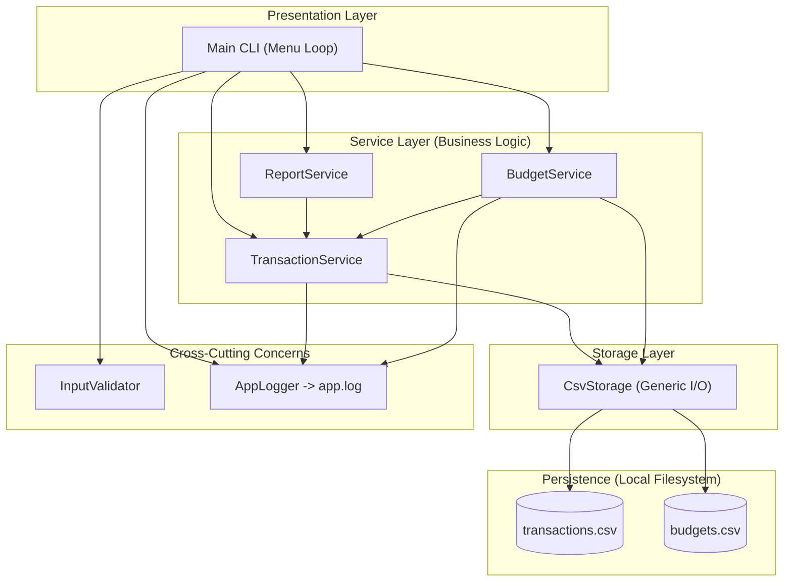
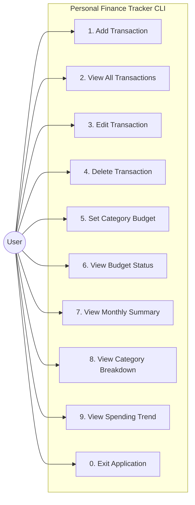
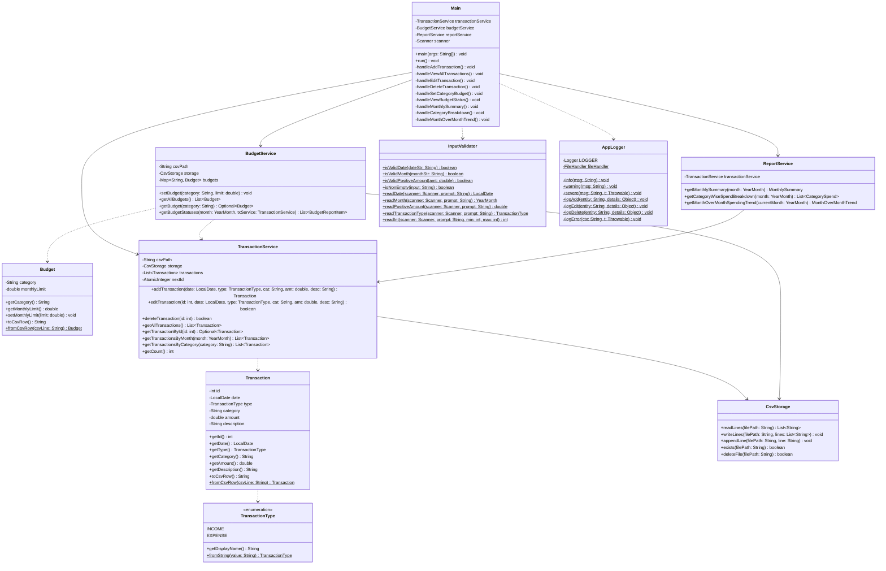
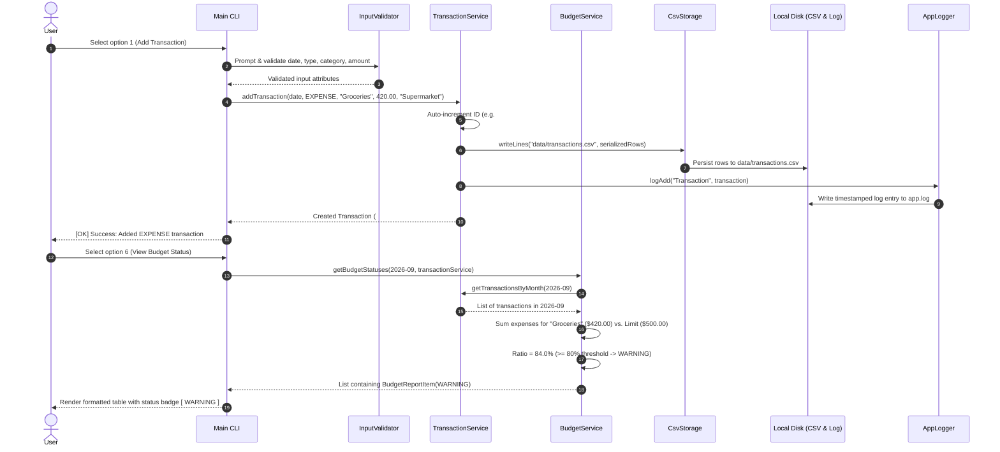
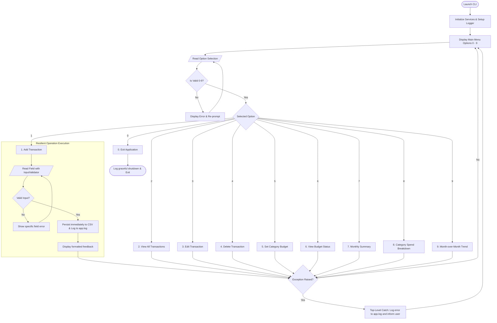

# System Architecture & Design Diagrams

This document contains architectural and behavioral design diagrams for the **Personal Finance Tracker** application, rendered using GitHub-compatible Mermaid syntax.

---

## 1. System Architecture Diagram
The application follows a clean, decoupled 4-tier layered architecture with cross-cutting utility concerns.

---

## 2. Use Case Diagram
Demonstrates all primary functional capabilities accessible to the end user through the CLI.

---

## 3. Class Diagram
Illustrates the models, services, storage layer, and utility relationships along with their core fields and operations.

---

## 4. Sequence Diagram: Add Transaction & View Budget Check
Traces the execution flow when adding an expense and checking category budget thresholds.

---

## 5. Activity / Workflow Diagram: CLI Menu Loop
Visualizes user interaction flow, input validation re-prompt loops, execution branches, and exception protection.

